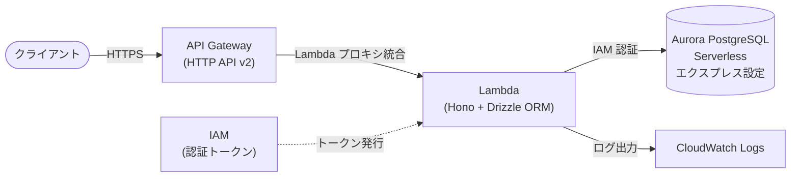

# aurora-express-drizzle-sample

Aurora PostgreSQL Serverless エクスプレス設定に Hono + Drizzle ORM で接続するサンプルコードです。
ローカル開発と AWS Lambda（API Gateway HTTP API v2）へのデプロイの両方に対応しています。

## アーキテクチャ



## 前提条件

以下のツールがインストール・設定済みであることを確認してください。

| ツール | バージョン | 用途 |
|--------|-----------|------|
| [Node.js](https://nodejs.org/) | v18 以上 | アプリケーションの実行 |
| [AWS CLI](https://aws.amazon.com/jp/cli/) | v2 | IAM 認証トークンの生成 |
| [Terraform](https://developer.hashicorp.com/terraform) | ~> 1.5 | インフラのプロビジョニング（Lambda デプロイ時） |
| [psql](https://www.postgresql.org/docs/current/app-psql.html) | v17 以上 | Aurora への直接接続（`npm run psql`） |
| AWS 認証情報 | - | Aurora への IAM 認証に使用（`aws configure` または環境変数で設定） |

Aurora PostgreSQL Serverless エクスプレス設定のクラスターは事前に作成済みで、IAM 認証が有効になっている必要があります。

## セットアップ（ローカル開発）

### 1. 依存パッケージのインストール

```bash
npm install
```

### 2. 環境変数の設定

```bash
cp .env.example .env
```

`.env` を編集して各値を設定します。

```
DB_HOST=my-cluster.cluster-xxxxxxxxxxxx.ap-northeast-1.rds.amazonaws.com
DB_USER=postgres
DB_NAME=postgres
AWS_REGION=ap-northeast-1
TZ=Asia/Tokyo
LOG_LEVEL=info
IS_LOCAL=true
```

### 3. テーブルの作成（マイグレーション）

マイグレーション実行時は IAM 認証トークンを URL に含める必要があります。
`.env` の値を自動で読み込むので、以下をそのまま実行してください。

```bash
npm run db:migrate
```

### 4. ローカルサーバーの起動

```bash
npm start
```

サーバーが起動したら curl で動作確認できます。

```bash
# 作成
curl -X POST http://localhost:3000/users \
  -H 'Content-Type: application/json' \
  -d '{"name":"クラスメソ太","email":"mesota@example.com"}'

curl -X POST http://localhost:3000/users \
  -H 'Content-Type: application/json' \
  -d '{"name":"クラスメソ子","email":"mesoko@example.com"}'

# 全件取得
curl http://localhost:3000/users

# 1件取得
curl http://localhost:3000/users/1

# 更新
curl -X PUT http://localhost:3000/users/1 \
  -H 'Content-Type: application/json' \
  -d '{"name":"クラスメソ次郎"}'

# 削除
curl -X DELETE http://localhost:3000/users/1
```

## デプロイ（AWS Lambda）

### 1. Lambda デプロイパッケージの作成

TypeScript のビルドと本番依存関係のバンドルを行い、`lambda.zip` を生成します。

```bash
npm run package
```

### 2. Terraform でインフラをプロビジョニング

```bash
cd terraform
cp terraform.tfvars.example terraform.tfvars
# terraform.tfvars を編集して db_host などを設定
terraform init
terraform apply
```

`terraform apply` 完了後、API の URL が出力されます。

```
api_url = "https://xxxxxxxxxxxx.execute-api.ap-northeast-1.amazonaws.com"
```

### Terraform 変数

| 変数名 | デフォルト値 | 説明 |
|--------|-------------|------|
| `aws_region` | `ap-northeast-1` | AWS リージョン |
| `function_name` | `aurora-express-drizzle-sample` | Lambda 関数名 |
| `db_host` | （必須） | Aurora クラスターエンドポイント |
| `db_user` | `postgres` | データベース IAM 認証ユーザー名 |
| `db_name` | `postgres` | データベース名 |
| `log_level` | `info` | ログレベル（debug / info / warn / error） |
| `tz` | `Asia/Tokyo` | タイムゾーン（IANA 形式） |
| `tags` | `{}` | リソースに付与する追加タグ |

### コードのみ更新（再デプロイ）

インフラ変更なしでコードだけ更新する場合は、`npm run package` 後に以下を実行します。

```bash
aws lambda update-function-code \
  --function-name aurora-express-drizzle-sample \
  --zip-file fileb://lambda.zip
```

### レスポンスヘッダー

Lambda 環境では全レスポンスに以下のヘッダーが付与されます。

| ヘッダー名 | 値 | 用途 |
|-----------|-----|------|
| `X-Lambda-Log-Stream` | `AWS_LAMBDA_LOG_STREAM_NAME` の値 | インスタンス識別・ウォームスタート確認 |

### Lambda スペック

| 項目 | 値 |
|------|----|
| アーキテクチャ | `arm64` |
| メモリ | `128 MB` |
| タイムアウト | `30 秒` |

## ディレクトリ構成

```
.
├── src/
│   ├── db/
│   │   ├── index.ts      # DB接続設定（IAM認証トークン自動更新）
│   │   └── schema.ts     # スキーマ定義（usersテーブル）
│   ├── app.ts            # Hono ルート定義（REST API）
│   ├── index.ts          # Lambda ハンドラーエントリーポイント
│   ├── local.ts          # ローカル開発用エントリーポイント
│   └── logger.ts         # ロガー設定（pino）
├── scripts/
│   ├── migrate.sh        # マイグレーション実行スクリプト
│   ├── package.sh        # Lambda デプロイパッケージ作成スクリプト
│   └── psql.sh           # IAM 認証で Aurora に psql 接続するスクリプト
├── terraform/
│   ├── main.tf                  # Terraform プロバイダー・共通設定
│   ├── variables.tf             # 入力変数定義
│   ├── outputs.tf               # 出力値定義
│   ├── lambda.tf                # Lambda 関数・CloudWatch Logs
│   ├── api_gateway.tf           # API Gateway HTTP API v2
│   ├── iam.tf                   # Lambda 実行ロール・IAM ポリシー
│   └── terraform.tfvars.example # 変数定義テンプレート
├── drizzle.config.ts     # Drizzle Kit 設定
├── .env.example          # 環境変数テンプレート
└── package.json
```
